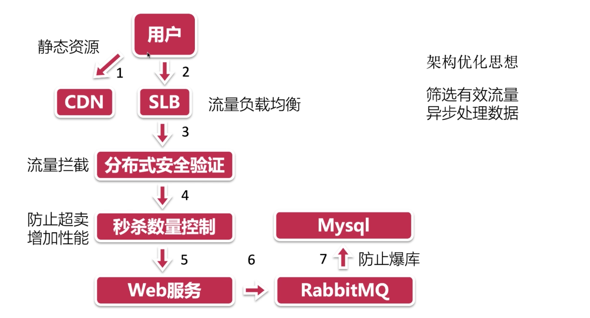
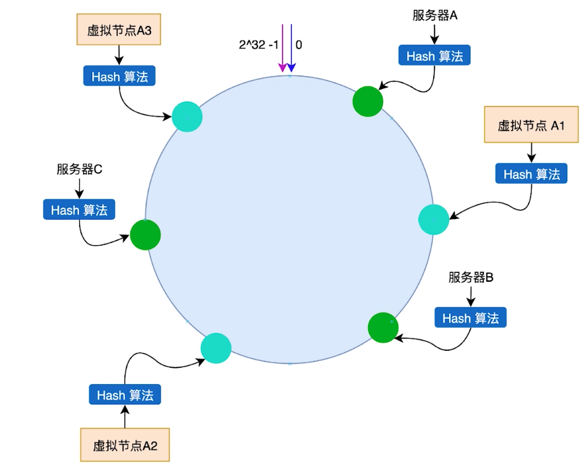
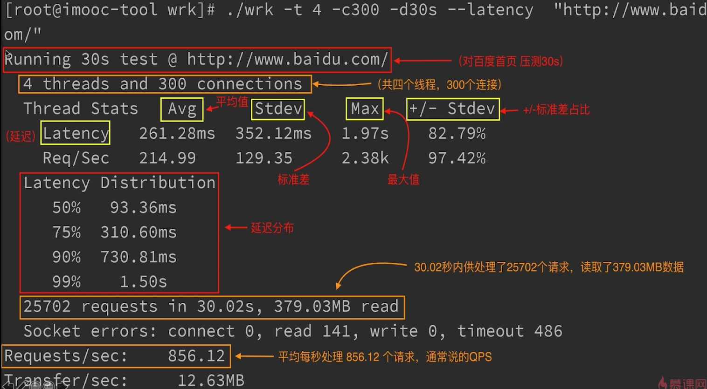
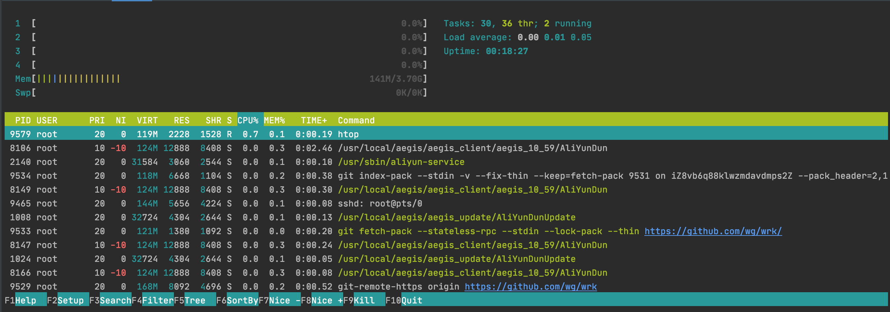

## 依赖库：

```sh
go get -u gopkg.in/ini.v1

go get -u github.com/kataras/iris

go get -u github.com/jinzhu/gorm 

go get -u github.com/unknwon/com

go get -u github.com/streadway/amqp
```


## 服务端优化思路



#### 分布式验证

- 一致性 Hash 算法

  > 用途：快速定位资源，均匀分布；
  >
  > 场景：分布式存储，分布式缓存，负载均衡；

  

  **[一致性hash算法原理及golang实现](https://segmentfault.com/a/1190000013533592)**

  

  结构示意图

  


#### Wrk 压测工具安装

- 安装

  - 在 centos 7 上执行 git clone https://github.com/wg/wrk

  - 进入 wrk 目录： cd wrk

  - 执行安装命令 : make

  - 使用介绍

    ```
    Usage: wrk <options> <url>                            
      Options:                                            
        -c, --connections <N>  Connections to keep open   
        -d, --duration    <T>  Duration of test           
        -t, --threads     <N>  Number of threads to use   
                                                          
        -s, --script      <S>  Load Lua script file       
        -H, --header      <H>  Add header to request      
            --latency          Print latency statistics   
            --timeout     <T>  Socket/request timeout     
        -v, --version          Print version details      
                                                          
      Numeric arguments may include a SI unit (1k, 1M, 1G)
      Time arguments may include a time unit (2s, 2m, 2h)
      
    -------
    使用方法: wrk <选项> <被测HTTP服务的URL>                            
      Options:                                            
        -c, --connections <N>  跟服务器建立并保持的TCP连接数量  
        -d, --duration    <T>  压测时间           
        -t, --threads     <N>  使用多少个线程进行压测   
                                                          
        -s, --script      <S>  指定Lua脚本路径       
        -H, --header      <H>  为每一个HTTP请求添加HTTP头      
            --latency          在压测结束后，打印延迟统计信息   
            --timeout     <T>  超时时间     
        -v, --version          打印正在使用的wrk的详细版本信息
                                                          
      <N>代表数字参数，支持国际单位 (1k, 1M, 1G)
      <T>代表时间参数，支持时间单位 (2s, 2m, 2h)
    
    ```

    

- 只支持 UNIX 系统

- 能用少量的线程测大量的链接

- htop 监控工具

  **[htop使用详解](https://www.cnblogs.com/yqsun/p/5396363.html)**

  ```sh
  yum instll -y htop
  使用： htop
  ```

  


